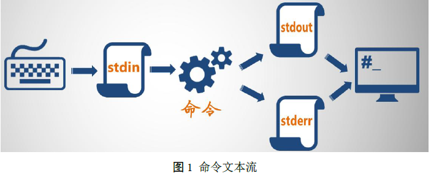
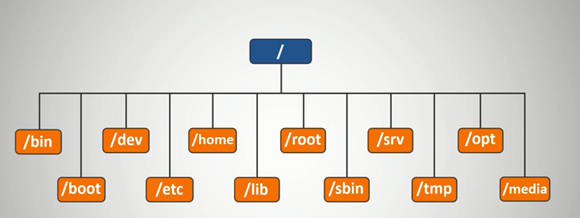

# linux常用命令

参考：中国大学MOOC，Linux系统管理（国家精品），宁波城市职业技术学院

[TOC]

<!-- toc -->

---

一个完整Linux 操作系统往往由4 部分组成：

1. 内核（Kernel）：内核是Linux 的心脏，实现操作系统的基本功能，包括控制硬件设备、管理内存、提供硬件接口、处理基本I/O、管理文件系统，为程序分配内存和CPU 时间等等。
2. 外壳（Shell）：是Linux 的交流窗口，提供用户与内核进行交互操作的接口。
3. 实用程序(Utilities)：实用程序则是工具，是用户用于进行系统日常操作和管理的一些程序。
4. 应用程序(Applications)：则是给用户提供各种各样的丰富的功能第三方程序，如各种服务器套件、文档处理套件、各种媒体播放和处理套件。

Linux中的命令在正常情况下最少有两个选项，`--help`和`--version`。


## man

帮助文档相关的命令有好几个，但是 最常用一就帮助文档相关的命令有好几个，但是 最常用一就man 命令， man 就是manual的缩写，用来查看系统中自带各种参考手册。

` man name` 或 `man section name` 。

man 命令可以后跟一个数字来表示 要查阅的用户手册 。若不加数字，那 man 命令默认从数字较小的手册中寻找相内容 ：
1. 命令：shell 中可以操作的指令或可执行文件。
2. 系统调用：系统核心可使用的函数与工具等。
3. 库函数：一些常用的函数 (function) 与库 (library) ，大部分为 C的库 (libc)。
4. 设备文件的说明，通常在 /dev 下的文件。
5. 配置文件：配置文件或者是某些文件的格式。
6. 游戏
7. 惯例与协议等，如 Linux 文件系统、 网络协议、ASCII码等等的说明。
8. 系统管理员可用的命令
9. 跟系统核心有关的文件

## 开/关机

关闭或者重启工作环境下的Linux主机， 正确的做法应该分三步走：
1. 查看在线用户和在线服务
2. 通知用户关机/重启原因和时间安排 
3. 下达关机命令


* `shutdown`：关机
* `shutdown -r`：重启系统

## 常用命令

### cd

`cd`：

* "~" 在 Bash中表示当前用户家目录
* "." 表示当前所在的目录 
*  ".." 表示当前所在目录的上一层
*  ”-” 则表示本次跳转前所处的目录

### mkdir

`mkdir`：与之相对的是`rmdir`。

* -p选项允许递归创建目录
* -m, --mode=模式， 设置权限模式。`mkdir -m 777 xxx`创建目录具有777权限。

### tar

对多个文件或文件夹进行打包（归档）

tar命令是一个古老的命令，其最初目的是用于将文件备份到磁带上，这也是命令名称的来源，tar即“tape archive”，磁带归档，的缩写。

`tar <操作> [选项] 归档文件列表`

操作：

* `-c`：创建一个新的归档文件
* `-r`：向归档文件末尾追加文件。`tar -f a.tar -r b.c`  将b.c添加到a.tar中。
* `-u`：更新归档文件
* `-x`：从归档文件中解压出文件。`tar -xf a.tar`  将a.tar解包到当前文件夹。
* `-t`：列出归档文件中的文件。`tar -tf a.tar`列出a.tar中的所有文件
* `--delete`：从归档文件中删除一个文件。`tar -f a.tar --delete a.c ` 删除a.tar中的a.c文件。
* `-A`：合并两个归档文件。`tar -f a.tar -A b.tar`  将b.tar合并到a.tar中。

选项：

* `-C`：指定一个解档目录
* `-f`：指定一个归档文件/设备进行操作。该选项必须紧跟归档文件名！
* `-z `：  调用gzip来压缩/解压缩文件

归档文件的`.tar`后缀名不是必须的，但是一般我们都会加上这个后缀，以告诉用户这个文件是一个归档文件。

### gzip

对文件进行压缩/解压。

`gzip [选项] 压缩/解压缩的文件名`

压缩：`gzip ./a.tar`

解压：`gzip -d a.tar.gz`

* `-c`：将输出写到标准输出上，并保留原有文件。
* `-d`：将压缩文件解压。
* `-r `：递归式压缩/解压缩指定目录中的所有文件。
* `-num`：用指定的数字num调整压缩的速度和压缩比。1-9，9为最大压缩比，压缩后的文件最小，但压缩时间长。默认为6。
* `-v `：对每一个压缩和解压的文件显示文件名和压缩比.
* `-t`：测试，检查压缩文件是否完整。

注意：gzip 在压缩文件过程中，会自动为文件添加一个“.gz”的后缀名，并且将原文件删除。如果要保留原文件，就必须使用-c 选项和Shell的输出重定向机制。

### locate

查找文件：`locate 查找路径 文件名的关键字`

查找速度很快，但并不是真正到硬盘上去查找文件，而是Linux将系统中所有的文件名都记录在一个名为`/var/lib/mlocate/mlocate.db`的数据库中，locate查找文件是从该数据库中查找。

因此，locate查找文件有一个重大限制，有时会查找到已经被删除了的数据，或者刚刚建立的文件无法找到。这是由于数据库不实时更新造成的，这个数据库默认情况下每天更新一次。我们也可以通过`updatedb`命令来手动更新这个数据库。

### find

在`<path>`指定的目录结构中搜索文件，并执行指定的操作。省略目录时在当前目录查找。

* `find  <path> <-option> [-print | -ls]  [-exec|-ok <command> {} \;]`

找到之后执行的操作：

* `-print`：将查找到的文件输出到标准输出。find命令的默认动作，将查找到的文件名输出
* `-fprint <filename>`： 将查找到的文件输出到指定文件
* `-ls`：将将查找到的文件名以`ls –dils`格式输出
* `-exec command {} \;`：将查到的文件执行command操作，`{}` 和` \;`之间有空格。用`{} `代表查找到的文件，之间无空格，用`\;`表示结束。
* `-ok`：和`-exec`相同，只不过在操作前要询问用户

find命令支持用逻辑运算符来操作单个逻辑条件，或者将逻辑条件连接起来：

1. `–a` 表示逻辑与 
2. ` –o ` 表示逻辑或 
3. `！`表示取反

注意：使用多个条件时，这些条件要用圆括号括起来，左右圆括号还要使用反斜杠`\`来进行转义，以防止shell的解释。

选项：

* 查找条件
  * `-name <filename>`：查找名为filename的文件，即按文件名（使用通配符进行匹配，加单引号）查找
  * `-iname <filename>`：与-name相同,只是忽略大小写（-i）
  * `-perm`：按执行权限来查找    
  * `-user <username>`：按文件属主来查找    
  * `-group <groupname>`：按组来查找    
  * `-user <username>`：按文件属主来查找    
  * `-amin <-n|+n>`：按文件**访问时间（access）**来查找文件，`-n`指n分钟以内，`+n`指n分钟以前    
  * `-atime <-n|+n>`：按文件访问时间来查找文件，`-n`指n天以内，`+n`指n天以前    
  * `-cmin <-n|+n>`：按文件**创建时间（create）**来查找文件
  * `-ctime <-n|+n>`：按文件创建时间来查找文件
  * `-mmin <-n|+n>`：按文件**更改时间（modified）**来查找文件
  * `-mtime <-n|+n>`：按文件更改时间来查找文件
* `-empty`：空白文件、空白文件夹、没有子目录的文件夹    
* `-newer <f1 !f2>`：查更改时间比f1新但比f2旧的文件    
* `-type <b|d|c|p|l|f>`：查是块设备/目录/字符设备/管道/符号链接/普通文件     
* `-prune`：忽略某个目录
* `-size <+n|-n>`：据文件大小查找文件，+n表示超过n大小的文件，-n表示小于n大小的文件
* ` -size <n[cwbkMG]>`：n表示文件大小的数值，b表示512字节的块，c表示Byte，k表示KB，M表示MB，G表示GB。
* `-type <[bcdpfls]>`：其中b表示块设备文件，c表示字符设备文件，d表示目录，p表示命名管道文件，f表示普通文件，l表示符号链接文件，s表示socket文件 

举例：

* `find ~ -size +100k \( -name core -o -name '*.tmp' \)`：从主目录开始查找大于100KB的名为core或`*.tmp`的文件。**圆括号前后面有空格**！也可以写成：`find ~ -size +100k '(' -name core -o -name \*.tmp ')'`
* `find . -type d`：从当前目录开始查找，寻找所有目录，打印路径名。按层次列出当前的目录结构。


### chmod

字母形式：`chmod [ugoa] [+-=] [rwx] file`：对不同用户使用字符赋予不同权限。

* u：user（主用户）、g：group（组用户）、o：other（其他用户）、a：all（所有用户）

数字形式：`chmod 3位八进制数 file`

修改文件权限：

* -R, -- recursive：以递归方式修改所有文件及其子目录。

权限对于文件和目录：

|      |      r       |             w             |       x        |
| :--: | :----------: | :-----------------------: | :------------: |
| 文件 |   读取文件   |         编辑文件          | 执行可执行文件 |
| 目录 | 列出目录内容 | 移动、建立、删除文件/目录 |    进入目录    |

```bash
chmod 777 a.c     # 将a.c文件的权限改为777
chmod +x  a.c     # 为a.c文件添加执行权限（3个用户都添加执行权限）
```


### ls

* `-F`：为不同类型的文件添加后缀
  * 目录：在文件名后加`/`
  * 可执行文件：`*`
  * 符号链接文件：`@`
  * 普通文件：无任何标记
* `-d`：directory，当ls 的参数是目录时，不像默认情况那样列出目录下的文件，而是列出目录自身的信息

`ls -l`显示的7个字段，如下所示：

```bash
-rwxr-xr-x    1 root root        87 Mar 20 21:49 s.py
```

| 字段 |   字段1    | 字段2  | 字段3  | 字段4  |  字段5   |    字段6     | 字段7  |
| :--: | :--------: | :----: | :----: | :----: | :------: | :----------: | :----: |
| 显示 | -rwxr-xr-x |   1    |  root  |  root  |    87    | Mar 20 21:49 |  s.py  |
| 含义 | 类型和权限 | 连接数 | 拥有者 | 文件组 | 文件大小 |  被修改时间  | 文件名 |

* 字段1有10个字符（第 11 个字符与SELinux 相关，我们此处不作讨论），分为4组：
  1. 文件类型。
  2. 剩下的9个字符分为3组，分别代表文件拥有者、文件组用户、其他用户 在该文件上拥有的权限。读（r）、写（w）、执行（x）和无权限(-)
* 字段5显示文件大小，默认为字节（Byte），可使用`-h`（`--human-readable`）选项让其更加易读。
  * 普通文件：列出文件大小
  * 目录：列出目录表大小，不是目录下文件长度和
  * 符号链接文件：列出符号链接文件自身的长度，不是指向的那个文件
  * 字符/块设备文件：列出主设备号与次设备号
  * 管道文件：列出管道内的数据长度

文件类型分类：

| 字符 |    -     |    d     |    l     |      c       |      b       |    p     |   s    |
| :--: | :------: | :------: | :------: | :----------: | :----------: | :------: | :----: |
| 意义 | 常规文件 | 目录文件 | 符号链接 | 字符特殊设备 | 模块特殊设备 | FIFO管道 | 套接字 |

### ll

`ll` == `ls -l`

### grep

global regular expression print

`grep 模式 文件名列表`

选项：

* `-n`：显示行号。如果只跟一个文件，它只会显示行号，不会显示文件名。
* `-v`：显示所有不包含模式的行
* `-i`：字符比较时忽略大小写

其他命令

* egrep：使用扩展正则表达式，在指定模式方面比 grep 更灵活。
* fgrep：快速搜索指定字符串，按字符串搜索，而不是按模式搜索。

### cp

`cp file1 file2`：复制file1为file2。

`cp 文件列表 dir/`：将多个文件复制到dir目录下。

复制文件：

* ` -R`，`-r`， `--recursive`： 递归复制目录及其子目录的所有内容。
* `-s`： 只创建符号链接而不复制文件。
* `-l `：只创建硬链接文件而不复制文件。

```bash
cp a.c dir/      # 复制a.c到dir目录下
cp a.c dir/b.c   # 复制a.c到dir目录下，并重命名为b.c
```

### rm

删除（unlink）文件：

* `-f` ：强制删除（Force）。忽略不存在的文件，不提示确认。
* `-i` ：在删除前需要确认 （inform，默认选项）。
* ` -R` ：递归（Recursive）删除目录及其内容。

### mv

移动文件或目录（可以直接移动目录）。此外，还可以用于重命名。

```bash
mv a.c dir/     # 把a.c移动到dir目录下
mv a.c b.c      # 把a.c重命名为b.c（当前目录下没有b.c文件）
```

### su

在不退出当前登录的情况下，临时切换用户身份：

* `-`或`-l`：在切换用户时，也切换到相应用户的登陆环境，包括家目录、shell定义等。
* 不带用户名参数，默认切换到root用户。即`su -`等价于`su - root`。

su只适合一两个人参与管理的系统，多人管理使用sudo命令。

### sudo

sudo命令允许规定的用户能够以在许可范围内以其他用户身份执行规定的命令。即分配给普通用户一些root用户才拥有的权限。

* sudo命令可以提供日志，忠实地记录每个用户使用sudo命令做了些什么，并将日志传送到中心主机或日志服务器。
* sudo的配置文件为`/etc/sudoers`。

`sudo -u 用户名 命令`：使用某用户执行命令，`-u`省略时使用root用户。

sudoers文件讲解：

```bash
## Allow root to run any commands anywhere 
root    ALL=(ALL)       ALL
# 用户 可登录的主机 =（可切换的用户身份列表 ） 可使用的命令列表

appwhy localhost=(root) /sbin/shutdown -h -5
%group_p 192.168.13.3=(root) NOPASSWD:/sbin/shutdown -h -5 # 用户组，免密
```

上述配置表明root用户可以在任何地方（远程终端）登录，并且以任何用户身份执行命令。

appwhy用户可以在本地登录，以root身份执行`/sbin/shutdown -h -5`这个命令。命令需要指定绝对路径。

### whoami

查看当前用户名

### id

`id user`：查看用户的uid、gid、用户所属用户组的信息。如果不指定用户，则显示当前用户的信息

### w

查看当前登录系统用户，及其详细信息。

### xargs

`xargs` 命令把标准输入追加到它的参数列表后面，再作为一个命令来执行。

`xargs` 经常与 `find` 配合使用。

## 链接

在 Linux中， 一个**文件**本身的数据总是放在在一个块 （block ）或者块的集合中文件的信息 （包括 文件类型、 读写权限、文件所有者、文件组、文件大小、文件链接数目，时间戳等 ）放在一个 inode 中，一个文件只对应一个 inode，而且这个 inode 在本文件系统内时唯一的。

在 Linux中，一个**目录**总是包含一个条目清单，所有此目录中的文件或子目录都在该清单中有一个条目，该条目包含这个文件名或目录名，已经指向该文件或目录的 inode的指针。

在Linux中，链接有两种：

* 符号链接(symbolic link，也成为symlinks) ：是指向包含另一目录条目的文件的一个目录条目。
* 硬链接 (hard link)：是文件或目录的另一个附加目录条目，允许同一文件或目录拥有多个名字。

通俗来说，文件的硬链接就可以理解为一个别名，而符号链接则可以视为文件的一个快捷方式。

* 普通用户没有创建目录硬链接的权限，只有root可以过` ln –d`命令强制为目录创建硬链接。创建目录硬链接有可能会在文件系统中引入遍历的死循环。
* 删除一个符号链接不会影响到这个符号链接指向的目标文件或目录。反过来，删除、移动、重命名符号链接指向的目标文件，不会导致这个符号链接被删除，只会让这个符号链接“断裂”。
* 如果一个文件有多个硬链接，仅在其最后一个硬链接被删除且硬链接数为0时，文件才会真正从文件系统中删除。
* 由于 inode 仅在 一个文件系统 (分区 )内是惟一的，因此硬链接不能跨越文件系统。
* 符号链接没有上面的限制，具更大灵活性，甚至可以跨越不同机器、不网络对文件进行链接。

### ln

创建链接：默认创建硬链接

* `-s`：创建符号链接

```bash
ln TARGET LINK_NAME     # 创建关于TARGET的链接
ln TARGET               # 在当前目录创建关于TARGET的链接 
ln TARGET... DIRECTORY  # 在指定目录中创建TARGET的链接
ln -t DIRECTORY TARGET  #
```

## 通配符与正则表达式

* 正则表达式：文本处理
* 文件名匹配：文件处理

### 通配符

通配符(wildcard)，这种支持也称为“globbing”（因为它最初被实现为一个名为 /etc/glob 的程序），让你能够使用通配符模式指定多个文件。

我们常常在 ls、cp、mv 或 rm 命令中需要操作多个文件或目录名时使用通配符。

任何包含  `*`、`?` 或  `[` 字符的字符串就是一个通配符模式。

* `*`：匹配0个或多个字符。
* `?`：匹配任意一个字符
* `[list]`：匹配list中的任意单一字符。`a[xyz]b` 匹配`axb`、`ayb`、`azb`。
* `[!list]`：匹配除了list中的任意单一字符。`a[!0-9]b` 表示 a与b之间必须也只能有一个字符，但不能是阿拉伯数字。
* `[c1-c2]`：匹配 c1-c2 中的任意单一字符。如：`[0-9]`、` [a-z]`、`[0-9a-fA-F]`
* `{s1,s2,s3,...}`：匹配s1/s2/s3中的任意一个字符串。

注意：

* `*`和  `?` 字符与它们自身匹配。如果在文件名中使用这些字符，那么需要注意适当的引用或转义。
* `!`在Shell中是有特殊含义的，因此需要小心地对它进行适当的转义。
* 文件通配符被单独应用到路径名的每个组成中。但我们无法匹配`/`。
* 命令中的任何通配符都可以被 shell 进行扩展，这将导致意外的结果。在使用 cp、mv 或 rm 出现异常行为之前，使用 ls 检查你的通配符模式。

注：

* `.` 作为文件名（如 `.bashrc`）或者路径名（如 `./aa.txt`）的**第一个字符**时，必须显示匹配。
* 路径分隔符 `/` 也需要显示匹配
* `~`：当前用户主目录
* `~appwhy`：用户appwhy的用户主目录

`-` 是可以作为文件名开头的，但是在使用相关命令时需要特殊处理。如Linux 命令 (如cp ，ls ，mv ，rm ，cat ，grep ，set 等)，用`--` 显式地标志命令行选项的结束，识别以 `-` 开头的处理对象。如：`rm -- -i`， 删除文件 `-i` 。


### 正则表达式

6个元字符：`.`，`*`，`[`，`$`，`^`，`\`。

`.`，`*`，`\`在方括号内时，代表他们自己。即`[\*.]` 表示匹配三个单字符

其他字符：

* `-`：定义一个区间，如`[a-z]`、`[][]`（匹配 `]` 、`[`）。若符号在最后面，则没有区间的意义。
* `^`：表示补集，如`[^a-z]`匹配任意非小写字母。如果`^`不在开头，则没有补集的意义。

锚点：

* `$`：在尾部时有意义，否则与自身匹配。`123$`表示匹配文件中行尾的123，不在行尾的123则不匹配。
* `^`：在首部时有意义，否则与自身匹配。`^123`表示以123开头。


**扩展的正则表达式（ERE）：**

* `()`：表示分组
  * `(xy)*` 可匹配 'xy'、'xyxy'，'xyxyxy'
  * `(abc|123)`：与'abc'或'123'匹配。
* 重复次数定义
  * `*`：0次或多次重复
  * `+`：1次或多次重复
  * `?`：0次或1次重复
  * `\{m,n\}`：重复m到n次
* 命名的预定义。如`\d`表示数字。

## 重定向

Bash实际上使用三种标准输入输出流：

* 标准输入流（stdin），向命令提供输入，文件描述符是 0。
* 标准输出流（stdout），显示来自命令的输出，文件描述符是 1。
* 标准错误输出流（stderr），显示来自命令的错误输出，文件描述符是 2。

对于任何一条linux 命令执行，它会是这样一个过程：



一般情况下，我们可以将stdout和stderr视为终端屏幕或者终端窗口，而将stdin视为终端键盘。

### 输出重定向

输出重定向：

1. `n>`：表示将来自文件描述符 n 的输出重定向到文件。必须对这个文件有写权限。如果文件不存在，就创建它。如果它存在，将覆盖原有文件内容。
2. `n>>`：表示将来自文件描述符 n 的输出重定向到文件。同样，必须对这个文件有写权限。如果文件不存在，就创建它。如果它存在，输出就附加到现有文件后面。

`n`代表文件描述符。如果忽略，就假设是标准输出。

使用 `&>` 或` &>>` 将标准输出和标准错误重定向到同一个位置。

`2>&1` 表示将文件句柄2重定向到文件描述符1指向的文件。

* `./stda >rpt 2>&1`：stdout与stderr均存入文件rpt。
* `./stda 2>&1 >rpt`：stderr重定向到终端，stdout重定向到文件rpt。

有时候希望完全忽略标准输出或标准错误。为此，可以把重定向到` /dev/null`中。

### 输入重定向

输入重定向：

1. 使用 `< `操作符将 stdin 重定向为来自文件。
2. `<< word` ：从shell脚本中获取数据，直到遇到定界符word。在此期间，如果遇到`$HOME` 或 `'date'`（实际括住date的是反单引号，这里显示不出来，用单引号代替），会将其替换成具体的值。
3. `<<'word'`：不对定界符之间的内容进行替换。
4. `<<<str`：str是一个字符串，这里会将其作为一个文件进行重定向。

Bash还有 here-document 的概念，这是输入重定向的另一种形式。这使用 `<< `以及一个单词（比如 EOF），这个单词作为输入结束的标志。

## 管道

本质上来说，管道就是一种特殊的重定向，也就是对一个命令的输出（stdout）进行管道连接（即重定向），用作下一个命令的输入。

* 管道命令只处理前一个命令正确输出，不处理错误输出。
* 管道的右边命令，必须能够接收标准输入流命令才行。

常用来作为接收数据管道命令有：sed, awk, cut, head, tail,top, less, more, wc, join, sort, split 等等，都是些文本处理命令。

## 查看机器相关信息


```bash
cat /etc/centos-release   # 查看发行版本号 查看发行版本号
# CentOS Linux release 7.4.1708 (Core)

uname -r                  # 查看内核版本号和机器架构
# 3.10.0-693.el7.x86_64
```


## 查看文本文件

查看与语言有关的环境变量设置

```bash
env | grep LANG

export LANG=en_US.UTF-8  # 设置编码
```

编码转换：

```bash
iconv -f gbk -t utf8 file  # 将文件的编码从gbk改为utf8 
```


### file

`file 文件名`：查看该文件信息，如使用的编码。

### cat

concatenate

`cat a.txt` 或 `cat a.txt b.txt` 。

将[文件]或标准输入组合输出到标准输出。如果没有指定文件，或者文件为`-`，则从标准输入读取。

* `-b`：对非空内容 输出行编号。
* `-E`：在每行的未尾添加$符号，便于确认每一行，因为有些行内容太长了，在显示时会在显示器上以多行表示。
* `-n`：对输出的所有行编号
* `-s`：将相连的多个空行用一个空行来代替
* `-T`：将Tab字符显示为`^I`


常用命令：

* `cat > try`：从stdin获取数据，存入try中，直到按下`Ctrl + D` 。

### od

octal dump，逐字节打定文件，可以使用不同的进制输出文件。

`od -t x1 x.dat` ： 以16进制打印x.dat。

### less

对文件或其它输出进行**分页显示**。逐屏显示文件

* `-n`：对输出的所有行编号
* `-M`：输出打开的文件名，当前显示的行数，总行数和光标当前所处文档位置
* `-s`：将相连的多个空行用一个空行来代替
* `-S`：截断过长的行而不换行显示

快捷键：

* `Enter`：向下滚动一行
* `Space`：向下翻页
* `q`：quit，退出
* `/pattern`：按指定模式（正则表达式）搜索字符串，`/` 表示继续查找。
* `Ctrl + L`：屏幕刷新

### head

`head a.txt` 或 `head a.txt b.txt` 。

将每个指定文件的前10行显示到标准输出。如果不指定文件，或者文件为"-"，则从标准输入读取数据。

* `-n K`：显示文件的前K 行内容。当K为负数时，表示不输出后|K|行。

* `-c K`：显示每个文件的前K 字节内容。

### tail

显示每个指定文件的最后10 行到标准输出。

* `-n K`：显示文件的最后K 行内容。当K前面有 `+` 时，表示不输出前K行。
* `-c K`：显示每个文件的最后K 字节内容
* `-f`：实时打印文件尾部被追加的内容（forever ）。` tail -f log.log`

### wc

word count

统计文件的行数、单词数、字符数（Byte）。

* `-l`：只列出行数。`ps aux|wc -l`：统计有多少个进程。

### tee

将从标准输入stdin得到的数据抄送标准输出stdout进行显示 ，同时存入磁盘 文件中。

`./myap | tee myap.log`： 将执行myap的结果输出到屏幕，并存储到日志文件在。

### sort

对文件内容按行进行排序。

* `-n`：Numberic， 对于数字按照算术值大小排序，而不是字符串比较。

### tr

translate

`tr string1 string2`
把标准输入拷贝到标准出，string1中出现的字符替换为string2中对应的字符。

* `cat a.txt | tr '[A-Z]' '[a-z]'`：将大写字母替换为小写字母
* `cat a.txt | tr % '\012'`：将%改为换行符（八进制）。

### uniq

筛选文件中的重复行（紧邻的两行内容相同）

用法：

* 无参（`-u`或`-d`）时，打印没有重复的行和有重复的行，但重复的行只打印一次。
* `-u`：unique，只打印没有重复的行
* `-d`：duplicated，只打印重复的行
* `-c`：count，对出现次数进行统计


### sed

流编辑：

* `sed 命令 文件名列表`
* `sed –e 命令1 –e 命令2 –e 命令3 文件名列表`
* `sed -f 命令文件 文件名列表`

命令的模式：

* `s`代表`substitute`，替换。
* `g`：如果一行中有多个匹配，则全部替换。
* `s/\([0-9][0-9]\)-\([0-9][0-9]\)-\([0-9][0-9]*\)/3.\1.\2/g`：将 04 -26 -1997 替换为 1997.04.26。


### awk

逐行扫描处理文本

awk分别为该程序的三位设计者姓氏的第一个字母

- `awk 命令 文件名列表`
- `awk -f 命令文件 文件名列表`

命令格式：

```bash
BEGIN {
    action;
}
condition {
    action;
};
END {
    action;
}
# 允许多段程序：段程序间用空格或分号隔开
```

处理方式：

* 输入文件的每行作为一个输入，变量 `NR` 就是行号。
* 每行用空格分隔开的部分，叫做记录的“域”，内置变量 `$1` 是第 1域内容，`$2` 是第 2域内容。特别的， `$0` 指的是整个这一行的内容。
* awk 的处理为：符合**条件**的行，执行相应的**动作**。

命令编写：

* 使用与C语言类似的关系运算符：`</<=/==/!=/>/>=`
* 逻辑运算符：条件非`!`，条件与`&&`，条件或`||`
* 可以使用正则表达式
* 特殊条件
  * 不知道任何条件，则对所有文本执行动作
  * BEGIN：开始处理文本之前，执行动作
  * END：处理完所有文本之后，执行动作
* 描述动作
  * 自定义变量
  * 加减乘除等算术运算
  * 正则表达式匹配运算符：`~`、`!~`。如`$2 ~ "[0-9]"`
  * 流程控制：if、for
  * `print var1 var2`
  * `printf("%s %s", var1, var2)`

举例：

* `ps -ef | awk '/guest/{ printf("% s ", $2); }'`
* `awk '{ printf("%d: %s\n", NR, $0); }' test.c`
* `date | awk '{print $4}'`
* `ls -ls | awk '$5>10 {print $10}'`


### cmp

`cmp file1 file2`

两文件逐**字节**比较，看是否完全相同。两个文件完全相同时，不给出任何提示；不同时，打印出第一个不同之处。

在Windows中有类似的命令`COMP`。

### diff

比较两个文本文件，以寻找二者之间的差别

```bash
diff file1 file2     # normal。显示中有a(add)、c(change)、d(delete)
diff -u file1 file2  # unified。类似于git中文件的比较
```


### md5sum/sha1sum

常用于数据完整性 （Data Integrity）验证和判断位于网络不同机器上的两个文件内容是否相同。

使用 MD5 算法（散列函数）根据文件内容生成 **16 字节** hash 值，比较 hash 值是否相同，就可断定两文件内容是否完全相

使用SHA-1算法的命令名为`sha1sum` (20 字节 hash 值)
其他散列函数也可以用来完成这一任务：`sha512sum`(64字节，512bit)

跨机器对比文件：

1. 在机器A上运行`md5sum 文件列表 > myfiles.sum`，并将myfiles.sum传输到机器B上。
2. 在机器B上运行 `md5sum -c myfile.sum`，对机器A、B上的文件进行比较。

失误率：

* MD5：pow(2, -128) 
* SHA-1：pow(2,-160)


## vim

vim有3种模式：

1. 一般模式（NORMAL）：会在屏幕的底部显示文件名或者是空白。在打开vim 时默认处于一般模式。可以执行大量操作。
2. 输入模式：底部会显示` –INSERT–`。
3. 命令行模式：键入`:`进入。
4. 可视模式：底部显示的是`–VISUAL–`。可使用 `d` 删除选择内容，`y` 复制选择内容。
   1. `v`：进入字符选择模式。
   2. `Shift+v`：进入行选择模式
   3. `Ctrl+v`：进入块（区域）选择模式
5. 搜索模式：键入`/` （正向查找）或 `?`（反向查找） 进入。按`n` 或`N` 进行正向或反向遍历。
   * `\*`：查找光标所在位置的单词。
   * `:n1,n2s/word1/word2/g`：在第n1和第n2行之间，查找word1这个字符串，并用word2来替换。
   * `:1,$s/word1/word2/g`：在整个文件中，查找word1这个字符串，并用word2来替换。
   * `:n1,n2s/word1/word2/gc`：在替换前询问使用者是否替换（conform）。


无论编辑器当前在什么模式， 按下 Esc 键，它都会回到一般模式。有时需要按两次`Esc`。

一般模式下移动光标：

| 快捷键 | h/`←` | j/`↓`/Enter | k/`↑` | l/`→` | ^/0  | $    |     w      |     b      |    G     |
| :----: | :---: | :---------: | :---: | :---: | :--: | ---- | :--------: | :--------: | :------: |
|  含义  | 左移  |    下移     | 上移  | 右移  | 行首 | 行尾 | 下一个单词 | 上一个单词 | 最后一行 |


| 快捷键 |            H             |           M            |             L              |
| :----: | :----------------------: | :--------------------: | :------------------------: |
|  含义  | 光标移到屏幕最上方那一行 | 光标移到屏幕中间那一行 | 光标移动到屏幕最下方那一行 |


| 快捷键 |   gg   |    nG     |    n$     |         Ctrl+o         |        f/F <字母>         |
| :----: | :----: | :-------: | :-------: | :--------------------: | :-----------------------: |
|  含义  | 第一行 | 第n行行首 | 第n行行尾 | 回到上一次光标所在位置 | 向后/前搜索字母并移动光标 |


| 快捷键 | `Ctrl+f`/`PgDn`  | `Ctrl+b`/`PgUp`  |     `Ctrl+d`     |     `Ctrl+u`     |
| :----: | :--------------: | :--------------: | :--------------: | :--------------: |
|  含义  | 屏幕向下移动一页 | 屏幕向上移动一页 | 屏幕向下移动半页 | 屏幕向上移动半页 |


| 快捷键 |      <<      |     `>>`     |     `Ctrl+l`     |          `Ctrl+g`          |      |
| :----: | :----------: | :----------: | :--------------: | :------------------------: | :--: |
|  含义  | 整行向左缩进 | 整行向右缩进 | 刷新屏幕（load） | 显示文件状态，行数、行号等 |      |


一般模式下对文本进行删除：

| 键 |      x/Delete      |     X/BackSpace     |     d^     |     d$/D     |  dd  | dw/daw/dnw | dG | d1G |
| :----: | :----------------: | :--------: | :--------: | :--: | :--: | :--: | ---- | :--: |
|  含义  | 删除光标所在的字符 | 删除光标前的字符 | 删除至行首 | 删除至行尾 | 删除/切剪当前行 | 删除1/n个单词 | 删除至文档结尾 | 删除至文档首部 |

还可以在命令前加上数字，表示执行多次相同操作。如`5dd`表示删除5行。

其他命令：

|  键  |     J      |    u/u {n}    |    Ctrl+r    | Shift+z+z  |       .        |     ~      |
| :--: | :--------: | :-----------: | :----------: | :--------: | :------------: | :--------: |
| 含义 | 删除换行符 | 撤回1/n次修改 | redo，反撤回 | 保存并退出 | 重复上一次操作 | 大小写转换 |


|  键  |     yy     |         y^/y0          |      p       |      P       |           ddp            |
| :--: | :--------: | :--------------------: | :----------: | :----------: | :----------------------: |
| 含义 | 复制当前行 | 复制到行首（不含光标） | 粘贴到光标后 | 粘贴到光标前 | 交换光标所在行与下面一行 |


|  键  |     r <字符>     |          R          |            cc            |        C         |
| :--: | :--------------: | :-----------------: | :----------------------: | :--------------: |
| 含义 | 替换光标处的字符 | 连续替换，直到按Esc | 删除当前行并进入插入模式 | 删除至行末并插入 |

把光标移到一个括号（`()/{}/[]`）上，按 `%` 可以快速将光标移动到与其匹配的另一个括号上。


从一般模式进入插入模式：

| 快捷键 |    i     |    I     |     a      |    A     |          o           |          O           |      |      |      |
| :----: | :------: | :------: | :--------: | :------: | :------------------: | :------------------: | :--: | :--: | :--: |
|  含义  | 当前光标 | 行首插入 | 光标后插入 | 行尾插入 | 在当前行下面插入新行 | 在当前行上面插入新行 |      |      |      |

### 命令行模式

在命令行模式下，可以使用 `:! 外部命令` 执行外部的shell命令。如 `:! ls` 显示当前目录内容。


|  键  |          `:ce`           |     `:ri`     |    `:le`     |      |      |      |
| :--: | :----------------------: | :-----------: | :----------: | :--: | :--: | :--: |
| 含义 | 是本行文本居中（center） | 靠右（right） | 靠左（left） |      |      |      |


|  键  |  `:10,50d`   |       `:1,.d`        |     `:.,$d`      |  `:10,50y`   |      |      |
| :--: | :----------: | :------------------: | :--------------: | :----------: | :--: | :--: |
| 含义 | 删除10到50行 | 删除文件首行到当前行 | 删除当前行到尾行 | 复制10到50行 |      |      |


|  键  |     `5,10co56`     |     `:5,10m56`     |      |      |      |      |
| :--: | :----------------: | :----------------: | :--: | :--: | :--: | :--: |
| 含义 | 复制5-10行到56行下 | 移动5-10行到56行下 |      |      |      |      |


命令模式下，常用命令：

|  键  |    w     | w <文件名> |       wq       |  q   |        q!        | e <文件路径> |
| :--: | :------: | ---------- | :------------: | :--: | :--------------: | :----------: |
| 含义 | 保存修改 | 另存为     | 保存修改并退出 | 退出 | 不保存，强制退出 | 打开相应文件 |


|  键  |           `r <filename>`           | `n1,n2 w <filename>`             |          e!          |
| :--: | :--------------------------------: | -------------------------------- | :------------------: |
| 含义 | 将filename中的内容插入当前行的后面 | 将n1到n2行的内容保存到filename中 | 将文件还原到最初状态 |


进行设置：

|  键  |  set nu  |       set nu?        | set shiftwidth=10 |   set all    |      |      |
| :--: | :------: | :------------------: | :---------------: | :----------: | :--: | :--: |
| 含义 | 显示行号 | 查看"显示行号"的属性 |   设置缩进为10    | 显示所有设置 |      |      |

要获取帮助命令，输入`:help` 或者按下 F1 键。 vim 会显示一个帮助概览的窗口。

### 同时编辑多个文件

`vim a.txt b.txt`：默认进入a.txt的编辑页面。

* `:n`：向后切换到b.txt的编辑页面。可以使用`:n!`进行强制切换，即不保存修改。
* `:N`：反向切换

常用命令：

* `:e 3.txt`：打开新文件

* `:e#`：回到前一个文件

* `:files`：列出目前这个vim打开的所有文件

* `:ls`：列出以前编辑过的文档

  ```bash
  :ls
    1 #    "a"                            line 1
    2 %a   "tp.py"                        line 7
  ```

* `:b tp.py` 或者 `:b 2`：直接进入tp.py进行编辑

* `:f`：显示正在编辑的文件名

* `:f new.txt`：将当前正在编辑的文件copy一份，命名为new.txt，需要`:w`保存后才会正在创建。

### 视窗操作

vim可以在一个界面中打开多个窗口进行编辑，这些编辑窗口称为vim的视窗。

常用命令：

* `new`：打开一个水平视窗。
* `sp  1.txt`：打开新的**水平**分屏视窗来编辑1.txt。省略文件名，表示两个窗口为同一文件内容，同步显示。
* `vsp 2.txt`：打开新的**垂直**分屏视窗来编辑2.txt
* `Ctrl+w s`：将当前窗口分割成两个水平的窗口
* `Ctrl+w v`：将当前窗口分割成两个垂直的窗口
* `Ctrl+w q`：即 :q 结束分割出来的视窗。如果在新视窗中有输入需要使用强制符！即:q!
* `Ctrl+w o`：打开一个视窗并且隐藏之前的所有视窗
* `Ctrl+w j`：移至下面视窗
* `Ctrl+w k`：移至上面视窗
* `Ctrl+w h`：移至左边视窗
* `Ctrl+w l`：移至右边视窗
* `Ctrl+w J`：将当前视窗移至下面
* `Ctrl+w K`：将当前视窗移至上面
* `Ctrl+w H`：将当前视窗移至左边
* `Ctrl+w L`：将当前视窗移至右边
* `Ctrl+w -`：减小当前视窗的高度
* `Ctrl+w +`：增加当前视窗的高度

### 其他

vim的配置文件为`~/.vimrc`，

由于断电等意外原因没有保存文档，可以使用`vim -r` 进入文档后，按`:ewcover a.txt` 来恢复a.txt文件。

当编辑一个文件时，在这个文件所处的目录底下就会有一个临时文件，文件名为 `编辑的文件名.swp`，这是一个隐藏文件， 所有修改都会暂时存在这个文件中。在编辑过程中，系统或者 vi 非正常关闭了，那么再重新用 vi 打开这个文件时，系统就会询问是否『Recovery』。按下 `R` ，就可以将数据回复到修改 ，就可以将数据回复到修改过程的样子，再将 swp 文件删除。

`vim -x a.txt`：对a.txt进行加密，需要保存后才能生效。


vim的“死机”现象：vi 编辑结束后执行存盘操作，结果导致屏幕卡死，输入任何信息都 再有显示（死机，终端死机）。原因是 vi 编辑结束后按下 `Ctrl+S`，因为 Windows编辑器一般设置 `Ctrl+S`热键的动作为 Save ，但 Linux 却进入**流量控制**状态。解决方法是按下 `Ctrl+Q` 后流量控制解除。

流量控制：终端的显示速度跟不上主机的发送速度，需要对主机发送的内容进行暂停显示。

意外终止问题：vi 编辑结束后存盘，程序意外中止，编辑成果丢失，文件内容未发生变化。原因是vi存盘命令为 `Shift+z+z`， 结果按错成 `Ctrl+z+z`，而`Ctrl+z`按键导致当前运行程序被挂起（suspend），暂停了运行。解决方法：调用bash作业的管理机制，恢复运行stopped状态的进程：

*  `jobs`：列出当前被Stopped的进程
* `fg %1` 或 `%1`：将1号作业恢复到前台（foreground）运行


## linux用户，uid

用户 (user) 是能够获取系统资源的权限集合 。Linux中的用户可 以分为三类：

1. 根用户 (root)：具有系统全部权限的用户。登陆后的提示符为 `#` 。UID=0
2. 普通用户：其使系统的权限受到一定制。登陆后的提示符为 `$` 。UID>=100（或者1000）
3. 系统用户：也称虚拟用户，是保障系统运行的用户，一般不通过Shell 登录系统 。

用户组（ group）就是具有相同特征的用户（ user）的集合体 。


UID 是确认用户权限的标识，用户登录系统所处的角色是通过UID 来实现的，而非用户名，因此，每个用户的UID必须是唯一的。

CentOS系统会把前 499个 UID 预留出来， 给系统虚拟用户占用，虚拟用户一般是系统安装时就有的，为了完成任务所必须的用户。但虚拟用户是不能登录系统的，比如 ftp、nobody、adm 、rpm 、binbin 、shutdown等。

有的系可能会把前 999 UID 和 GID 预留出来。

以各个系统的`/etc/login.defs`中的`UID_MIN`为为准。

用户和用户组的对应关系可以是一对一、多对一、一对多、多对多， 一个用户可以从属于多个用户组，一个用户组也可以包含多个用户。但在同一时间内，一个用户的主用户组（primary group）或者说有效用户组（effective group）只能有一个。

在默认情况下每个新建的普通用户都从属于一个单独的和用户名同名的用户组。

查看用户可以使用两个命令`id`和`finger`（finger命令系统不自带）。

* id工具更侧重用户、用户所归属的用户组、UID 和GID 的查看
* finger侧重用户信息的查询，比如用户名（登录名）、家目录、登录SHELL类型等等。


增删改用户或用户组：

1. 使用相关命令
2. 直接修改相关配置文件

以上命令的本质是修改如下文件：

* `/etc/passwd`和`/etc/shadow`：passwd是系统识别用户的一个文件（系统通过该文件和用户名找到用户对应的uid），shadow存放用户密码。
* `/etc/group`和`/etc/gshadow`：用户组的配置文件，内容包括用户和用户组，并且能显示出用户是归属哪个用户组或哪几个用户组。

passwd文件字段解释：`root:x:0:0:root:/root:/bin/bash`

| 字段 |  root  |  x   |  0   |  0   |       root       | /root  | /bin/bash |
| :--: | :----: | :--: | :--: | :--: | :--------------: | :----: | :-------: |
| 解释 | 用户名 | 密码 | uid  | GID  | 用户全名（可选） | 家目录 | shell类型 |

`/etc/shadow`文件是`/etc/passwd `的影子文件，这个文件并不由`/etc/passwd `而产生的，这两个文件是应该是对应互补的；shadow内容包括用户及被加密的密码以及其它`/etc/passwd `不能包括的信息，比如用户的有效期限等。


```bash
useradd 用户名  # 为系统添加一个用户，包括 用户名、用户ID ，以及Home目录
usermod 用户名
userdel 用户名  # 删除某个用户。-r：表示在删除用户的同时，一并把用户的家目录及本地邮件存储的目录或文件也一同删除，慎用。

passwd 用户名   # 为用户修改密码。root用户可修改其他用户。

groupadd 用户组名  # 为系统添加一个新用户组
groupmod 用户组名
groupdel 用户组名  # 在删除用户组的时候请万分小心，因为这有可能涉及到其它和这个用户组相关的用户。如果有用户将这个用户作为主用户组(primary group)，则不能删除。
```

## 文件系统





* `/bin`：用户和管理员必备的二进制文件。系统常用命令
* `/sbin`：系统管理员必备，但是一般用户根本不会用到的二进制文件
* `/usr`：usr指`Unix System Resource`，而不是User。
  * `/usr/bin`：不是用户必备的二进制文件。都是系统预装的可执行程序，会随着系统升级而改变
  * `/usr/sbin`：不是系统管理员必备的工具
  * `/usr/local/bin`：是给用户放置自己的可执行程序的地方。推荐放在这里，不会被系统升级而覆盖同名文件。
  * `/usr/include/`：C语言头文件存放目录
  * `/usr/lib/`：和 `/lib/`目录一样。
  * `/usr/src/`：存放需要使用源码安装的软件博爱源码
* `/etc/`：提供系统维护管理用的命令和配置文件。文件格式为文本文件，功能类似于windows的注册表。
  * 主要文件：`passwd、hosts、*.conf`。
  * 主要目录：`ssh、xinet.d、apt、network`
  * 系统启动阶段系统初始化和启动服务的脚本 `rc*.d` 。
  * 自定义的需要自启动的服务脚本 `rc.local`。
  * `profile`、`bashrc` 系统级bash等shell的偏好设置。
* `/tmp/`：临时文件，每个用户都可以在这里临时创建文件，但只能删除自己的文件，不可以其他用户创建的文件。
* `/var/`：系统运行时要改变的数据、系统日志syslog等。
* `/dev/`：设备文件，如终端设备、磁带机、打印机等。
* `/lib/`：Linux广泛使用动态链接库，静态链接库已经逐渐过时。
  * 各种库文件（如C语言的链接库文件，terminfo终端库等）
  * 静态链接库文件，`.a` 后缀（archive，存档）
  * 动态链接库文件，`.so`后缀（shared objects，共享的目标代码，多个`.o` 文件的集成）


`/bin`、`/sbin`目录是在系统启动后挂载到根文件系统中的，所以这两个目录必须和根文件系统在同一分区。`/usr/bin`、`usr/sbin`可以和根文件系统不在一个分区。

## 硬盘管理

使用`fdisk -l`查看磁盘信息。

对磁盘进行分区 ( Partition ) 前，磁盘是无法用来存储数据的。事实上，对磁盘进行分区的作用就是告诉操系统，磁盘可存储数据的区域，也即每个分区的起始柱面和结束柱面。 这些分区信息都包括在一个叫做分区表（Partition Table ） 的数据结构中。

分区表是一块磁盘中最重要的数据，一般存储在磁盘的0磁道上面 （所以 当一个硬盘的0磁道发生了物理损坏的时时候，这个硬盘就基本宣告寿终正寝了 ）。

硬盘仅为分区表保留了 64 个字节的存储空间，而每分区参数占据 16个字节的存储空间，故主引导扇区中总计可以存储 4个分区的数据， 这就是 主分区 （Primary）+扩展分区 （Extended） 最多只能有四个的原因了。


对硬盘进行分区主要使用命令`fdisk`。


如上图所示，可分为4个区，3个主分区，1个扩展分区（该分区又被划分为3个逻辑分区）。

使用`mount`、`unmount`命令来挂载和卸载设备。

```bash
mount   # 不带参数，列出当前已经安装的所有子文件系统
mount 分区/设备名 挂载目录
unmount 分区/设备名/挂载目录
```


* `mkfs /dev/sdb`：在块设备文件上创建文件系统（make filesystem）
* `mount /dev/sdb /mnt`： `/mnt` 是预先创建好的一个空目录。挂载子文件系统。

### dh

`df`命令显示所有文件系统和磁盘块的使用情况，可使用参数`-h`让输出更易读。

## 网络配置与管理

查看网络接口是否启动并配置好，我们可以使用` ifconfig`命令来完成 。

用`ifconfig`来改变接口的 配置参数是临时,也就是说 ,如果系统重启 ,或者网络重启的话 ,这些改变的参数是不会保留下来的。

```bash
ifconfig eth0 up    # 启动网络接口eth0
ifconfig eth0 down  # 关闭网络接口eth0

ifconfig eth0 172.168.19.54 netmask 255.255.255.054 
# 设置接口eth0网络地址为 172.168.19.54，子网掩码为255.255.255.0
```

linux系统中与网络配置有关的文件：

* `/etc/services`：
* `/etc/host.conf`：
* `/etc/nsswitch.conf`：
* `/etc/xinetd.conf`：
* `/etc/modules.conf`：
* `/etc/sysconfig/network`：为主机设置全局网络参数（不针对单个网络接口）。`GATEWAY`参数会被`/etc/sysconfig/network-scripts/ifcfg-ethN`中的同名参数覆盖。
* `/etc/hosts`：是一个用于储存计算机网络中各节点信息的文件，负责将主机名映射到相应的IP地址。hosts文件通常用来补充或取代小型网络中DNS的功能。
  * `IP地址   主机名（Hostname）   主机别名（Alias）`
* `/etc/resolv.conf`：DNS客户端配置文件。
* `/etc/sysconfig/network-scripts/ifcfg-ethN`：N是一个具体数字，代表主机网络接口的序号。
  * 注意， 网络接口配置文件中的某些会影响到 主机上其他网络接口甚至整 个整主机网络配置。


### netstat

`netstat`是一个监控本机端口状态的的工具。输出网络连接 , 路由表 , 接口统计数据 , 伪连接 ,及多播成员的相关信息。

* `-l`：显示正在监听的连接（不显示已经建立的连接）
* `-t`：只显示tcp连接
* `-u`：只显示udp连接
* `-n`：以数字形式显示地址和端口号
* `-p`：显示连接从属的进程PID和进程名称
* `-a`： 显示所有连接和监听端口

* `netstat -ltp`：查看监听中的TCP连接。

字段意义：

* Proto：连接使用的协议，主要是TCP和UDP。
* Recv-Q：尚未接收的字节数。
* Send-Q：尚未发送到目标的字节数。
* Local Address：本机地址 `主机IP:端口号`。如果ip为`0.0.0.0`或`*`，表示在所有链接的相应端口。如`0.0.0.0:22`就表示在本机所有链接的22 端口上都进行监听。
* Foreign Address：目标地址与端口。
* State：当前Socket连接的状态。
  * ESTABLISHED：连接已建立
  * SYN_SENT：正在尝试建立连接（发出SYN标志）
  * SYN_RECV：接收到一个建立连接的请求
  * FIN_WAIT1：socket关闭，正在进行连接中断
  * FIN_WAIT2：连接已中断，但socket正在等待对方回应。
  * TIME_WAIT：连接已中断，socket仍在等待，处理仍存在于网络中的包。
  * LISTEN：已建立监听，socket正在监听端口输入，但尚未建立连接。


## 软件包管理

RPM （Red Hat Package Manager）包管理器（简称 RPM ，全称为 The RPM Package Manager）是Linux下广泛使用的软件包管理器。

RPM 包管理器只能管理以RPM形式封装的软件包

每个 RPM 软件包是一个压缩的文档，包含了内容信息、应用程序文件、图标，文档和用作管理的脚本。

`tsclient-0.132-6.i386.rpm`：

| 字段 |  tsclient  |             0.132-6              |   i386   |
| :--: | :--------: | :------------------------------: | :------: |
| 含义 | 软件包名称 | 带有版本号和发行版本的软件包名称 | 硬件架构 |

硬件架构：

|  架构  |                 适用机器                  |
| :----: | :---------------------------------------: |
|  i386  |      适于任何现有的 Intel兼容计算机       |
| noarch |               适于所有架构                |
|  ppc   | 适于 PowerPC系统，如Apple Power Macintosh |
| x86_64 |   适于64位Intel处理器，如 Intel Core i7   |

rpm 包有二进制安装 包（ Binary）以及源代码安装包（Source）两种。  二进制包可以直接安装在计算机中，而源代码将会由 RPM 自动编译、安装。二进制包常以 `rpm `作为后缀名，源代码包经常以 `src.rpm` 作为后缀名。

`rpm [选项] 软件包名`：RHEL和 CentOS中自动安装、配制、卸载和升级软件包的工具组合。

* `-i <安装包名称>`：安装软件，经常`-ivh`连用。
* `-v`：显示安装时的详细信息。
* `-h`：安装时输出`#`最为进度条。
* `-e <软件包名称>`：卸载软件。
* `-q <软件包名称>`：查询软件包。
* `-a`：列出所有软件包，常`-qa`连用。

RPM 有一个久为用户诟病的缺点，就是无法解决软件依赖问题。究其原因，正是 由于 RPM 程序是已经打包好的数据，也就是说，里面的数据已经都编译完成，所有安装时一定需要当初安装时的主机环境才能安装。当初建立这个软件的安装环境必须也要在当前主机上重现才行 。

### yum

YUM（Yellow dog Updater Modified）是为了解决 RPM 的依赖关系问题，方便使用者进行软件的安装、升级等工作 。


yum只是为了解决RPM的依赖关系，而不是一种其他的软件封装模式，可以将yum视为RPM的一个前台工具。

每一个 RPM 软件包的头（ header ）里面都会纪录该软件的依赖关系， yum就是通过分析header得到相关的依赖关系。

当第一次使用 yum 或 yum 源有更新时 ，yum会自动下载所有所需的headers 放置于`/var/cache/yum`目录下，所需时间会比较长。

常用命令：

* `yum clean all`：清除缓存中旧的rpm头文件和包文件。
* `yum makecache`：建立新的缓存。
* `yum list`：列出所有升级源上的包。
* `yum list available`：列出资源库中所有可以安装或更新的 rpm 包。
* `yum list updates`：列出所有升级源上的可以更新包。
* `yum list installed`：列出已经安装的包。
* `yum search <关键字>`：搜索rpm包。
* `yum info <软件包名>`：列出资源库中特定的可以安装或更新，以及已经安装的 rpm 包的信息。
* `yum install <软件包名>`：安装rpm包。
* `yum update <软件包名> `：更新rpm包。
* `yum remove <软件包名> `：卸载rpm包。

RPM软件源（Repositories）是一 个目录，或者一个网站，里面包含了许多 RPM 软件包及其索引文件，我们安装软件时就是从该软件源上下载的包。

有许多公司和社区提供 CentOS entOS entOS entOS entOS rpmrpmrpm官方 源，国内比较常用的有： 源，国内比较常用的有：

* 网易源： http://mirrors.163.com
* 搜狐源： http://mirrors.sohu.com
* 中科大源： http://centos.ustc.edu.cn
* CentOS源： http://mirror.centos.org

一个软件源（ Repositories）中可能会配置多个软件仓库（Repository）。Centos默认自带的`CentOS-Base.repo`源已经预先配置了5个仓库：

1. `base`：构成 CentOS的基本软件包，和光盘上内容相同 。默认启动。
2. `updates`：Base 仓库中软件包的更新版本。默认启动。
3. `extras`：一大批附加的软件包。默认启动。
4. `centosplus`：针对 base 及 updates软件库内的组件的更新。这些更新的组件并不属于正式的发行，所以在扩展CentOS功能的同时，牺牲了与先前版本的兼容性。启用这个软件库会导致CentOS与正式版本有差别。默认不启动。
5. `contrib`：包含了CentOS用户贡献的组件，它们并不会与核心发行版本的组件重叠。这些组件并没有经过CentOS的开发者测试，也不一定会跟随CentOS的发行同步。

其他软件源：

* EPEL 源：https://fedoraproject.org/wiki/EPEL/zh-cn
* RepoForge源： http://repoforge.org
* RPMFusion 源： http://rpmfusion.org
* Remi源：http://rpms.famillecollet.com
* Atrpms源：atrpms.net
* ELRepo源：elrepo.org

CentOS的软件源配置文件位于`/etc/yum.repos.d/`目录下。

自己配置软件源：

1. 安装相关软件：` yum install yum-plugin-priorities `。

2. 确保`/etc/yum/pluginconf.d/priorities.conf`文件下有如下内容：

   ```
   [main]
   enable=1            # 启动本插件
   check_obsoletes=1   # 防止一些已经废弃 (obsoletes)的包出现
   ```

   

查看机器架构与CentOS版本信息，选择合适的软件源，进行下载：

```bash
# 下载相关源，在http://repoforge.org/use/找的资源
wget http://repository.it4i.cz/mirrors/repoforge/redhat/el7/en/x86_64/rpmforge/RPMS/rpmforge-release-0.5.3-1.el7.rf.x86_64.rpm

# 安装源
rpm -ivh rpmforge-release-0.5.3-1.el7.rf.x86_64.rpm

# 此时在/etc/yum.repos.d/目录下就有新安装的软件源配置了
```

打开`/etc/yum.repos.d/rpmforge.repo`，在`[rpmforge]`最下面添加：

```bash
[rpmforge]
# 其他配置
priority = 10
```

优先级由 1 ~ 99 这99个数表示， 1 的优先级最高。

## 进程

程序是为了完成某种任务而设计的软件。而一个运行中的程序就被称为进程。

进程的一个比较正式定义是：在自身虚拟地址空间运行的一个单独的程序。

一个运行着的程序，可能包含多个进程。

进程分类：

* 交互进程：由一个shell启动的进程。既可以在前台运行，也可以在后台运行。
* 批处理进程：和终端没有联系，是一个进程序列。
* 守护进程：Linux系统启动时会自启动，并在后台运行。一般由系统在开机时通过 一个叫做 init 的脚本自动激活启动，或超级管理用户root来启动。它独立于控制终端，并且周期性地执行某种任务或等待处理某些发生的事件。

### 进程操作

快捷键：

- `Ctrl+Z`：挂起当前进程
- `Ctrl+C`：终止当前进程

进程的恢复：

* `fg`或`fg [n]`：恢复到前台继续运行。
* `bg`或`bg [n]`：恢复到后台继续运行。

`jobs` ：查看被挂起的进程。

### ps（process status）

`ps`是最常用的进程查看命令。

* `l`：长格式输出
* `u`：按用户名和启动的时间顺序来显示进程
* `j`：用任务格式来显示进程
* `f`：用树形格式来显示进程
* `a`：显示所有用户的所有进程
* `x`：显示无控制终端的进程
* `r`：显示运行中的进程
* `--sort [+/-]`：按指定顺序输出

```bash
ps aux                # 最常用命令
ps aux --sort %cpu    # 按cpu使用升序排列
ps aux --sort -%mem   # 按内存使用降序排列

ps afux               # 查看进程的父子关系
```

`ps`命令经常和`grep`命令一起使用，对进程进行筛选。

进程描述符（Process Descriptor）：

* USER：启动进程的用户
* PID：进程标志号
* PPID：父进程的PID。父子进程之间的关系是管理与被管理的关系，当父进程终止时，子进程也随之终止。反之则不一定。
* %CPU：运行该进程占用CPU的时间与该进程总的运行时间的比例。
* %MEM：该进程占用的内存和总内存之比。
* VSZ：占用的虚拟内存大小。
* RSS：进程占用的物理内存值。
* TTY：进程创建时所对应的终端，`?`表示该进程不占用终端。
* STAT：进程的状态
  * D：不可中断的睡眠
  * R：就绪（在可运行队列中）
  * S：睡眠
  * T：被跟踪或停止
  * Z：终止（僵死，zombie）的进程
  * W：没有足够的内存分页可供分配
    * <：高优先序的进程
    * N：低优先序的进程
    * L：有内存分页分配并锁在内存体内（实时系统或I/O）。
    * +：位于后台的进程
    * s：进程的领导者（在它之下有子进程）
* START：进程开始时间
* TIME：进程已执行的时间
* COMMAND：对应的命令名

### top

top是一个动态监视进程的工具。默认情况下，每3秒刷新一次。

* `-d`：指定更新的间隔，以秒为单位。
* `-q`：没有任何延迟的更新。如果是root用户，top命令会以最高的优先序执行。
* `-c`：显示进程完整的路径与名称。

数据段解释：

* VIRT：进程逻辑地址空间大小 (virtual)
* RES ：驻留内存数 (Resident)， 也就是占用物理内存数
* SHR ：与其他进程共享的内存数 (share )
* %CPU：占用CPU百分比
* %MEM：占用内存百分比
* TIME+：占用的CPU时间

与top交互的快捷键：

* `space`：立即更新
* `>`：向下翻页
* `<`：向上翻页
* `T`：按进程运行时间排序，降序
* `M`：按内存使用情况排序，降序
* `N`：按进程id排序，降序
* `P`：按CPU占用情况排序，降序
* `R`：反向排序
* `k`：结束指定进程


### kill

终止进程：`kill [-signal] pid`

* `-signal`：表示向进程发出的信号 。如果没有指定任何信号，默认发送的信号为 SIGTERM（`-15` ），可将指定进程终止。若仍无法终止该进程。可使用更强力的SIGKILL（`-9`）信号尝试强制终止进程 。

`killall`是通过程序的名字，直接杀死相关的所有进程。常用`ps|grep`配合使用。

`kill` 命令的工作原理是，向 Linux系统的内核发送一个操作信号和某个程序的进程标志号，然后系统内核就可以对进标志号指定的进程进行操作。

当需要终止一个前台进程的时候，通常使用` ctrl+c`组合键；但是对于后台进程就必须使用` kill `命令。

### 守护进程

守护进程经常以超级用户（root）保持运行。因为它们要使用特殊的 端口（1-1024）或访问某些特殊的资源。

守护进程是非交互式序，没有控制终端，所以任何输出（stdout、stderr）都需要特殊处理。

分类：

* 系统守护进程：为系统提供某种重要的功能。
* 网络守护进程：向用户提供某种网络服务。

Linu x守护进程的工作模式是服务器 /客户端（Server/Client），服务器在一个特定的端口上监听（Listen）等待客户连接，连接成功后服务器和客户端通过端口进行数据通信。守护程的工作就是打开一个端口，并且监听（Listen）等待客户连接。如果客户端产生一个连接请求，守护进程就创建（Fork）一个子服务响应这个请求，而主服务器继续监听其他的服务请求。

工作模式分类：

* 独立守护进程（stand-alone daemon）：该守护进程可以独立运行，常驻内存，响应快，无服务启动时间。所有独立守护进程的脚本都在`/etc/rc.d/init.d/`目录下，由`ini`脚本负责管理。
* 超级守护进程（super daemon）：RHEL使用的超级守护进程叫做 xinted（eXtended InterNET Daemon），它能同时监听多个指定的端口，根据用户请求端口的不同，来启动不同的网络服务进程来处理这些用户请求。

和 stand alone工作模式相比，系统不必为每一个网络服务进程监听其服务端口，这样降低了系统开销， 有效利用 系统资源。

但是对于访问量大、经常出现并发时，xinetd 想要频繁启动对应的网络服务进程， 反而会导致系统性能下降。因此，对于负载高服务，比如 Apache、sendmail等服务是单独启动的。

对于 CentOS，在默认情况下，守护进程一般来说都是独立进程， 除非进行过配置，否则 xinted这个超级守护进程是不开机启动的。

运行不必要或有漏洞的守护进程会给操作系统带来安全和性能上的影响。

在 RHEL/CentOS中，服务脚本基上全部放在 `/etc/init.d/`这个目录下，实际上这些脚本是放在 `/etc/rc.d/init.d/` 目录中的， `/etc/init.d/`是一个符号链接。

脚本的内容大致包括如下内容 ：脚本的描述、环境调用、搜寻配置文件、加载 functions、服 务的启动停止与加载、最后还会有脚本参数。这些脚本都可以直接运行。

### systemctl

systemctl是systemd下的一个工具，也是CentOS7中控制服务的主要工具，用于替代CentOS 6 中的service和chkconfig两个命令。

```bash
systemctl is-enabled <服务名称>.service   # 查询服务是否开机启动
systemctl enable <服务名称>.service       # 开机运行服务
systemctl disable <服务名称>.service      # 取消开机运行
systemctl start <服务名称>.service        # 启动服务
systemctl stop <服务名称>.service         # 停止服务
systemctl restart <服务名称>.service      # 重启服务
systemctl reload <服务名称>.service       # 重新加载服务配置文件
systemctl status <服务名称>.service       # 查询服务运行状态
systemctl --failed                       # 显示启动失败的服务
```

## 远程管理

SSH所需要的有软件：

* openssh（核心文件 ）
* openssh-clients（SSH客户端）
* openssh-server（SSH 服务器端）：守护进程名为`sshd`，开机自启动。

SSH的安全配置分为3部分：

* SSH服务器自身的安全配置
* 系统防火墙的配置
* 通过可靠手段向用户公布主机指纹

SSH的配置文件为`/etc/ssh/sshd_config`，可以通过修改相关配置，来拒绝特定用户联机、主动断开长时间没有动作的客户端，等等。

ssh登陆远程主机：`ssh [选项] username@IPAddress`

* -p 指定主机 SSH 端口，如不指定默认为 22 端口。

常用远程连接软件：

* putty
* xshell
* SecureCRT

配置ssh秘钥登陆：

1. 在用户A的家目录下执行命令`ssh -keygen -t rsa`，生成秘钥（公钥、私钥），位于`~/.ssh/`目录下。
2. 将公钥内容复制到`~/.ssh/authorized_keys`文件中。
3. 分发秘钥：在想要登陆到用户A的客户端中（比如用户B），将用户A中生成的私钥放置在用户B的`~/.ssh/`目录下。通过此私钥，用户B就可以在远程终端上通过SSH客户端以用户A的身份连接到主机。


