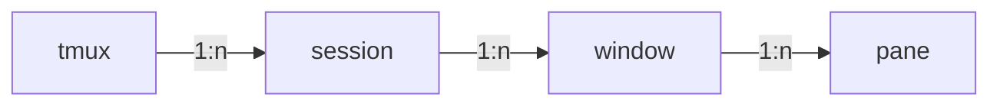

## tmux

参考：http://www.ruanyifeng.com/blog/2019/10/tmux.html

tmux组织图如下所示：

**tmux快捷键**

* `tmux ls`： 显示所有存在的session
* `tmux attach [-t session_name]`： attach一个存在的session
* `tmux kill-session -t <session-name>`： 关闭一个session
* 
* `tmux` 或  `tmux new -s <session_name>`： 新建一个session
* **session**
  * `Ctrl+d` 或 `exit`：关闭当前session
  * `Ctrl+b s`：列出所有会话，可以在这些会话中进行切换
  * 
  * `tmux detach` 或 `Ctrl+b d`： 与当前session分离
  * `Ctrl+b $`：重命名当前会话
  * 
  * `Ctrl+b c`：创建一个新窗口，状态栏会显示多个窗口的信息。
  * **window**
    * `Ctrl+b &`： 关闭当前window
    * `Ctrl+b w`：从列表中选择window（会列出所有session的所有window）（可以使用左右方向键实现window的展开与折叠）
    * 
    * `Ctrl+b p`：切换到上一个window（按照状态栏上的顺序）。
    * `Ctrl+b n`：切换到下一个window。
    * `Ctrl+b <number>`：切换到指定编号的窗口，其中的`<number>`是状态栏上的窗口编号。
    * `Ctrl+b ,`：窗口重命名。
    * 
    * `Ctrl+b %`：划分左右两个pane
    * `Ctrl+b "`：划分上下两个pane
    * **pane**
      * `Ctrl+b x`：关闭当前pane
      * `Ctrl+b q`：显示pane的编号，再按对应的编号，就能将光标移动到该pane上
      * 
      * `Ctrl+b z`：当前pane全屏显示，再使用一次会变回原来大小
      * `Ctrl+b <arrow key>`：光标切换到其他pane
      * `Ctrl+b ;`：光标切换到上一个pane，使用该快捷键可以在2个pane之间来回切换
      * 
      * `Ctrl+b {`：当前pane与上一个pane交换位置。
      * `Ctrl+b }`：当前pan与下一个pane交换位置。
      * `Ctrl+b Ctrl+<arrow key>`：按箭头方向调整pan大小
      * `Ctrl+b !`：将当前pane拆分为一个独立window。
